# GUINDO BADARA ALIOU MSDIA FSM
### MASSAR 2100000017

# TP 5
# Application Web JEE avec Spring Boot

## Objectif
Créer une application Web JEE basée sur **Spring**, **Spring Data JPA**, **Hibernate**, **Thymeleaf** et **Spring Security** permettant de gérer des produits.

## 1. Création du projet avec les dépendances utiles

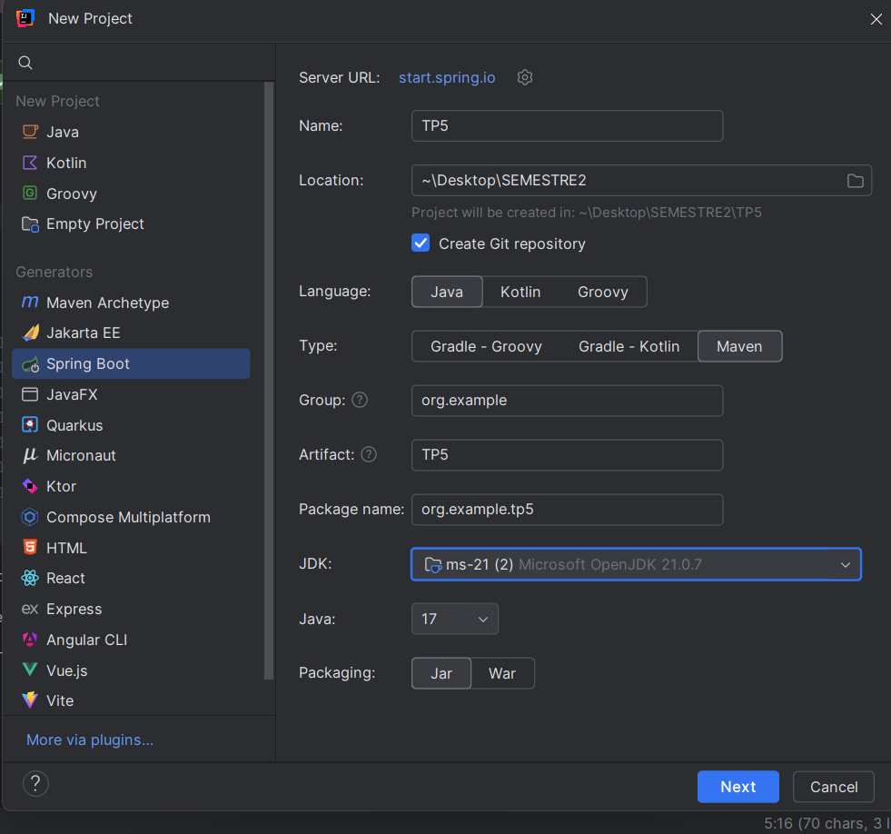
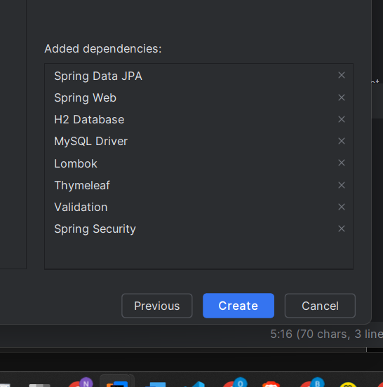

---

## 2. Création de l'entité `Product` avec les annotations Lombok

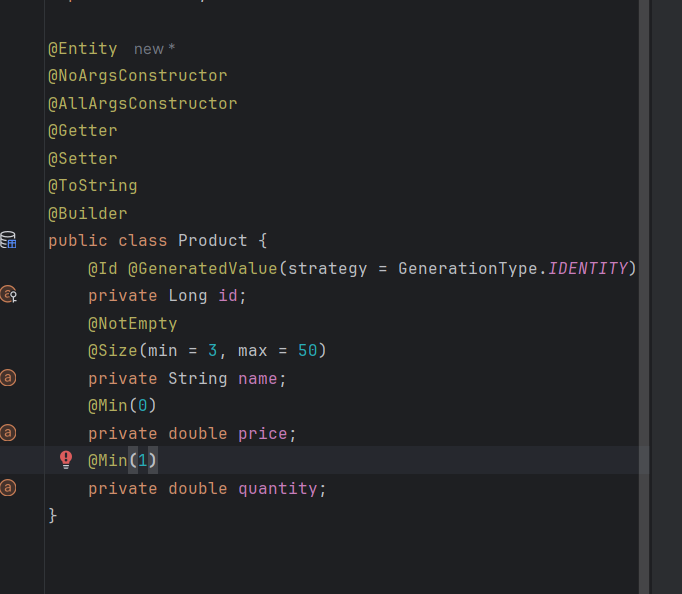
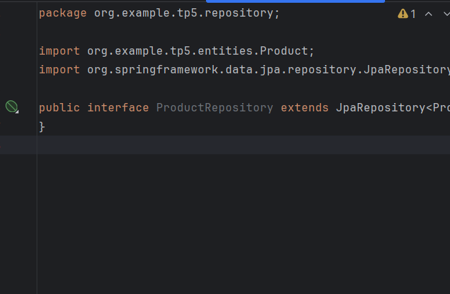

---

## 3. Test de la couche DAO

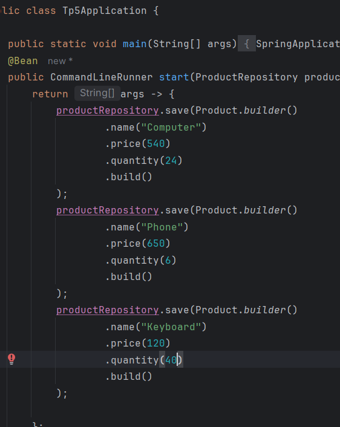
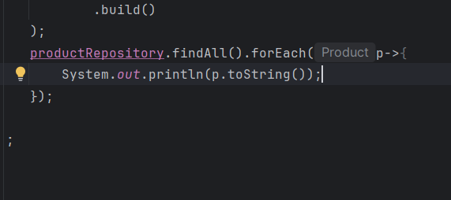

---

## 4. Configuration de `application.properties`

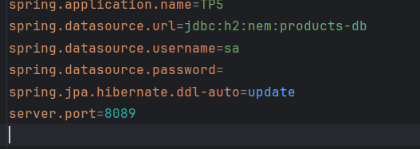

---

## 5. Résultat

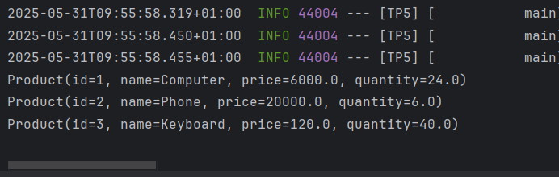
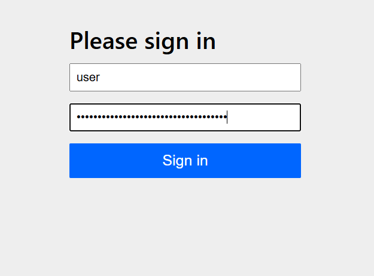
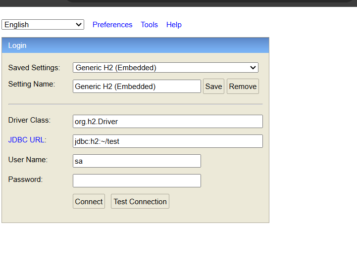
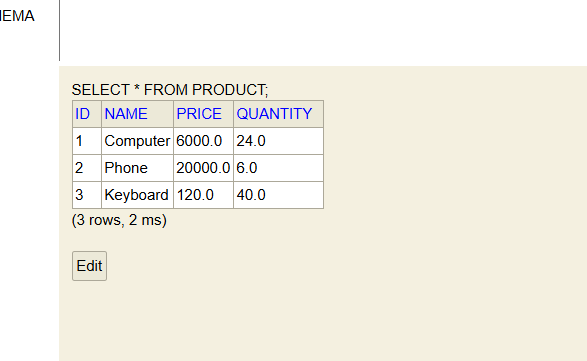

---

## 6. Création d'une méthode dans le contrôleur Spring MVC

La méthode permet d'afficher la page `products` avec le mapping `/index` et d'envoyer la liste des produits à la page HTML via le modèle.

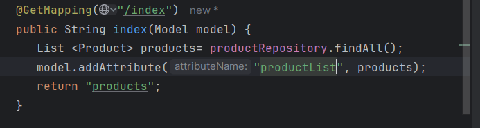

---

## 7. Ajout d’un bouton **Delete**

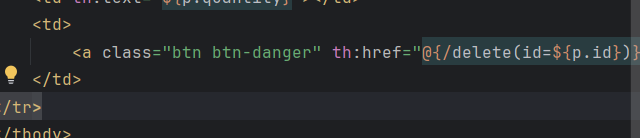
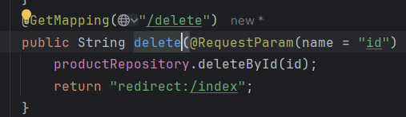
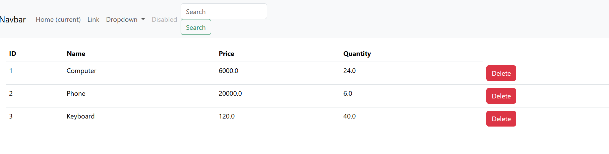

---

## 8. Ajout de la page `newproduct.html`

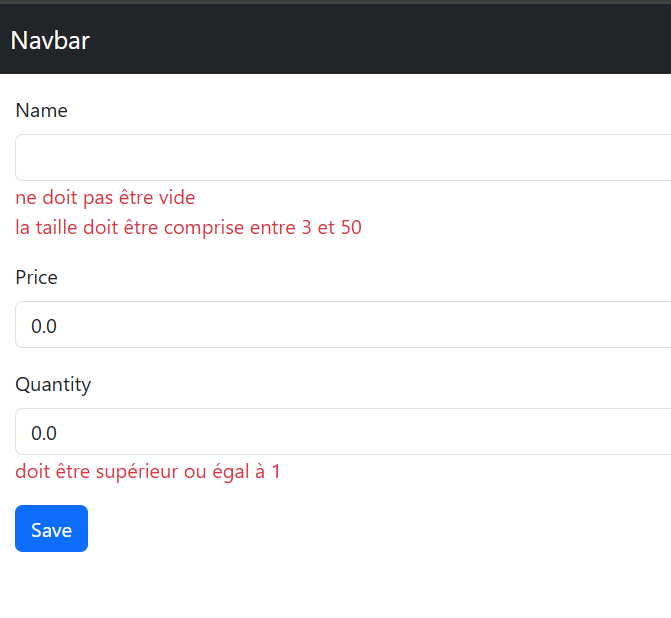

---

## 9. Ajout de la méthode `saveProduct` dans le contrôleur

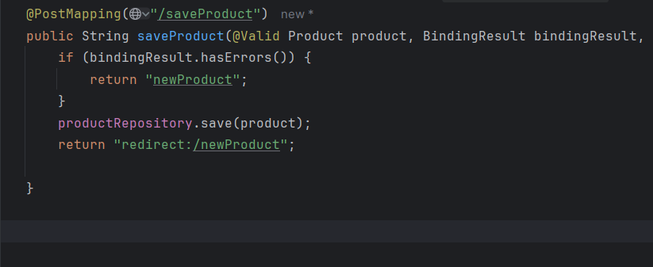

---

## 10. Sécurisation de l'application avec Spring Security

On configure la sécurité de l’application Spring Boot à l’aide de Spring Security.  
La classe `SecurityConfig` définit :
- des utilisateurs en mémoire avec rôles (`USER`, `ADMIN`) pour simplifier les tests sans base de données,
- une méthode `securityFilterChain` pour restreindre l’accès :
    - `/index/**` autorisé aux utilisateurs avec rôle `USER`,
    - `/save/**`, `/delete/**` autorisés uniquement aux `ADMIN`,
    - toutes les autres requêtes nécessitent une authentification.

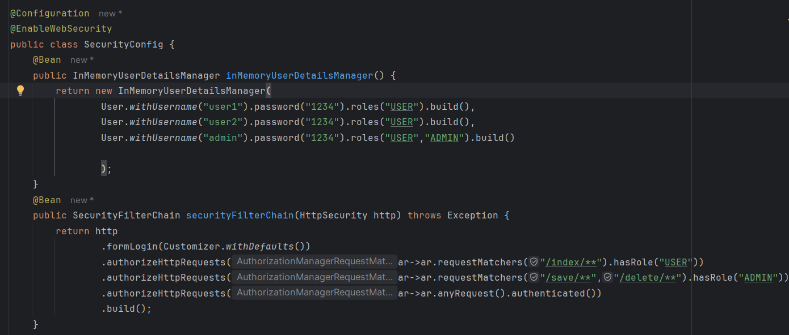

---

## 11. Création d’un formulaire de login personnalisé

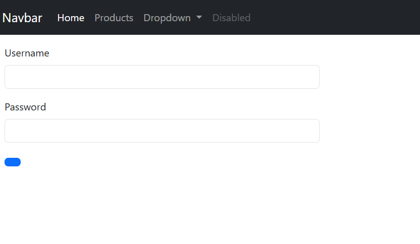

---

## 12. Reconfiguration du logout

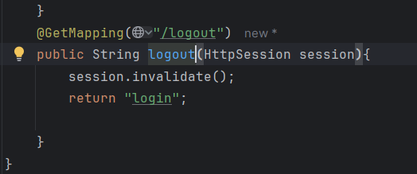

---

